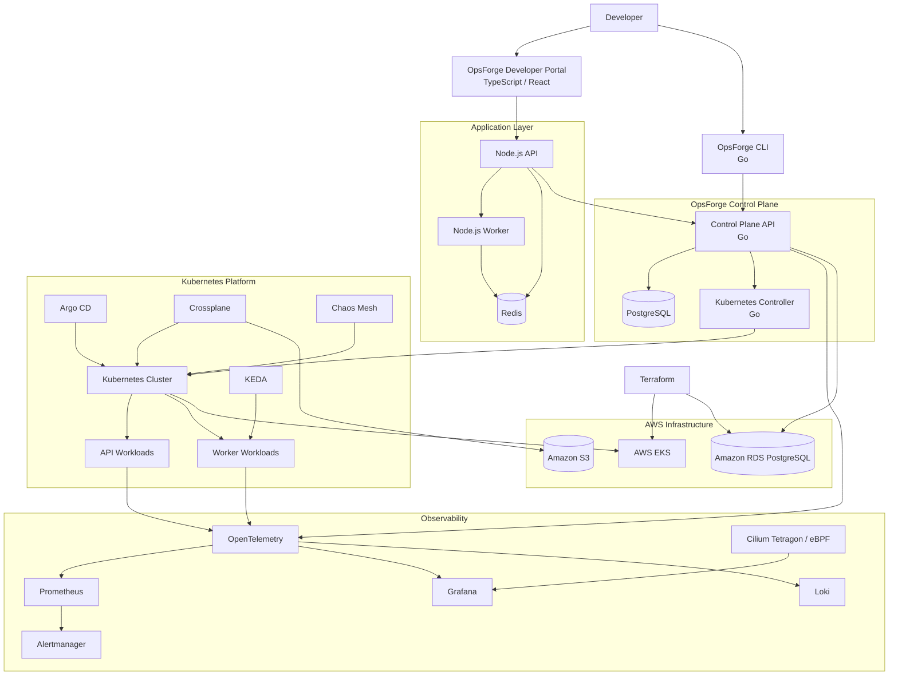

# OpsForge 2.0

### Internal Developer Platform • SRE • Cloud Native • DevSecOps

**OpsForge 2.0** is a cloud-native Internal Developer Platform (IDP) and Site Reliability Engineering (SRE) framework designed to demonstrate how engineering teams can build, deploy, observe, secure, and operate distributed applications.

The platform combines **application development, Kubernetes orchestration, Infrastructure as Code, GitOps, observability, security automation, event-driven scaling, infrastructure provisioning, and failure engineering** into a single engineering environment.

> **OpsForge is built around one principle:**
> **Build it. Deploy it. Observe it. Break it. Recover it.**

Rather than presenting isolated DevOps tools, OpsForge demonstrates how those tools interact as one operational system.

---

## 🎯 What Is OpsForge?

Modern DevOps and SRE work is not about knowing individual tools in isolation.

A production engineering platform typically has to answer questions such as:

* How does a developer deploy an application?
* How is infrastructure provisioned?
* How does Kubernetes maintain desired state?
* How does the platform scale workloads?
* How do engineers detect failures?
* How do they trace requests across services?
* How are vulnerabilities detected before deployment?
* How does the system recover from failure?
* How are infrastructure changes managed safely?
* How does an engineer investigate an incident?

OpsForge provides a hands-on environment for answering those questions.

The platform combines:

```text
Application Engineering
        +
Cloud Infrastructure
        +
Kubernetes
        +
Platform Engineering
        +
GitOps
        +
Observability
        +
Security
        +
SRE
        +
Failure Engineering
```

---

# 🏗️ Architecture

OpsForge operates across three primary environments:

1. **Local Development**
2. **Kubernetes Platform**
3. **AWS Cloud Infrastructure**



---

# 🧩 Core Platform Components

| Layer                  | Technology         | Responsibility                              |
| ---------------------- | ------------------ | ------------------------------------------- |
| Developer Portal       | TypeScript / React | Self-service platform interface             |
| Control Plane          | Go                 | Platform API and orchestration              |
| CLI                    | Go                 | Command-line platform operations            |
| Kubernetes Controller  | Go                 | Reconciliation and desired-state management |
| Application API        | Node.js / Express  | REST application service                    |
| Worker                 | Node.js / Bull     | Background job processing                   |
| Queue                  | Redis              | Asynchronous workload processing            |
| Database               | PostgreSQL         | Platform metadata and persistence           |
| Container Runtime      | Docker             | Application containerization                |
| Orchestration          | Kubernetes         | Workload scheduling and lifecycle           |
| Packaging              | Helm               | Kubernetes application packaging            |
| Configuration          | Kustomize          | Environment-specific configuration          |
| Infrastructure         | Terraform          | AWS infrastructure provisioning             |
| Infrastructure Control | Crossplane         | Kubernetes-native infrastructure management |
| GitOps                 | Argo CD            | Declarative cluster delivery                |
| Autoscaling            | KEDA               | Event-driven worker scaling                 |
| Metrics                | Prometheus         | Metrics collection                          |
| Dashboards             | Grafana            | Operational visualization                   |
| Logs                   | Loki               | Centralized logging                         |
| Telemetry              | OpenTelemetry      | Distributed telemetry                       |
| Alerting               | Alertmanager       | Alert routing                               |
| Runtime Security       | Cilium Tetragon    | eBPF-based runtime visibility               |
| Security Scanning      | Trivy              | Container and IaC vulnerability scanning    |
| CI                     | GitHub Actions     | Automated validation and delivery           |
| CI Alternative         | Jenkins / Groovy   | Pipeline automation                         |
| Chaos Engineering      | Chaos Mesh         | Controlled failure experiments              |

---

# 🚀 Quick Start

OpsForge provides two primary execution environments.

## 1. Local Development

The local environment is intended for development, experimentation, and learning.

### Prerequisites

Install:

* Docker
* Docker Compose
* Git
* Node.js
* Go
* Python
* PowerShell

Clone the repository:

```bash
git clone https://github.com/kunal-1207/OpsForge.git
cd OpsForge
```

Start the local platform:

```bash
docker compose up --build -d
```

Check running services:

```bash
docker compose ps
```

### Local Services

| Service         | URL                    |
| --------------- | ---------------------- |
| OpsForge Portal | http://localhost:5173  |
| Node.js API     | http://localhost:3000  |
| Grafana         | http://localhost:3001  |
| Jaeger          | http://localhost:16686 |

Ports may vary depending on the current Compose configuration.

---

# ☸️ Kubernetes Deployment

OpsForge can be deployed to a local Kubernetes cluster such as:

* kind
* minikube
* Docker Desktop Kubernetes

Apply the development overlay:

```bash
kubectl apply -k kubernetes/overlays/dev
```

Verify workloads:

```bash
kubectl get pods -A
```

Check services:

```bash
kubectl get svc -A
```

Check deployments:

```bash
kubectl get deployments -A
```

---

# ☁️ AWS Infrastructure

Terraform is responsible for provisioning the foundational AWS infrastructure.

The infrastructure layer can provision components such as:

```text
AWS
├── VPC
├── Networking
├── IAM
├── EKS
├── RDS
└── Supporting resources
```

Location:

```text
infrastructure/terraform/
```

Typical workflow:

```bash
terraform init
terraform fmt
terraform validate
terraform plan
terraform apply
```

> **Important:** AWS credentials must never be committed to the repository.

Use the AWS CLI credential chain, environment variables, or an appropriate CI/CD secret-management mechanism.

---

# 🏗️ Platform Engineering

OpsForge introduces a dedicated control plane implemented in **Go**.

The control plane provides the foundation for platform automation.

```text
Developer
    │
    ▼
OpsForge Portal / CLI
    │
    ▼
Go Control Plane
    │
    ├── PostgreSQL
    │
    └── Kubernetes Controller
              │
              ▼
          Kubernetes
```

The control plane is responsible for platform-level operations rather than application business logic.

---

# 🐹 Go Engineering

Go is used throughout the platform for cloud-native engineering.

Components include:

### Control Plane API

Provides the platform API.

### CLI

Provides command-line access to platform operations.

Example:

```bash
opsforge app list
opsforge app get payments
opsforge app deploy payments
opsforge app status payments
opsforge app rollback payments
```

### Kubernetes Controller

The controller demonstrates the Kubernetes reconciliation model.

Conceptually:

```text
Desired State
     │
     ▼
Custom Resource
     │
     ▼
Go Controller
     │
     ▼
Reconciliation
     │
     ▼
Actual Kubernetes State
```

This provides hands-on experience with:

* Go
* Kubernetes APIs
* CRDs
* controllers
* reconciliation
* structured logging
* REST APIs
* CLI development
* concurrency
* testing

---

# 🗄️ PostgreSQL

PostgreSQL provides persistent storage for platform metadata.

The database is used for information such as:

* applications
* environments
* deployments
* deployment events
* incidents
* audit events

The database layer demonstrates:

* relational modeling
* SQL
* migrations
* indexes
* constraints
* transactions
* connection management

Database configuration is externalized and must never contain committed credentials.

---

# 🔄 GitOps with Argo CD

Argo CD provides declarative Kubernetes delivery.

The desired workflow is:

```text
Developer
    │
    ▼
Git Commit
    │
    ▼
Git Repository
    │
    ▼
Argo CD
    │
    ▼
Kubernetes
```

Argo CD provides:

* declarative deployments
* synchronization
* drift detection
* deployment health
* rollback capabilities

Configuration:

```text
kubernetes/argocd/
```

Example:

```bash
kubectl apply -f kubernetes/argocd/opsforge-app.yaml
```

---

# 📈 Event-Driven Autoscaling with KEDA

OpsForge uses Redis-backed background jobs to demonstrate event-driven scaling.

The scaling model is:

```text
Application
    │
    ▼
Redis Queue
    │
    ▼
Queue Depth
    │
    ▼
KEDA
    │
    ▼
Worker Replicas
```

When queue depth increases, KEDA can increase worker capacity.

When workload decreases, worker capacity can scale down.

Configuration:

```text
kubernetes/base/keda-scaledobject.yaml
```

This complements Kubernetes HPA by allowing scaling based on application workload signals rather than only CPU or memory utilization.

---

# 🔭 Observability

OpsForge treats observability as a first-class platform capability.

## OpenTelemetry

OpenTelemetry provides distributed telemetry across application and platform components.

The telemetry pipeline can include:

```text
Application
    │
    ▼
OpenTelemetry
    │
    ├── Metrics
    ├── Logs
    └── Traces
```

This enables distributed request analysis across:

```text
API
 ↓
Go Control Plane
 ↓
Redis / PostgreSQL
 ↓
Worker
```

---

## Prometheus

Prometheus collects operational and application metrics.

Examples include:

* request rate
* request latency
* error rate
* resource utilization
* queue depth
* worker processing rate

---

## Grafana

Grafana provides operational dashboards for:

* application health
* Kubernetes resources
* workload performance
* infrastructure utilization
* SRE indicators

---

## Loki

Loki provides centralized log aggregation.

Services produce structured logs where practical, allowing engineers to correlate logs with operational events.

---

## Alertmanager

Alertmanager handles alert routing and grouping.

Alerts can cover:

* service availability
* elevated error rates
* latency
* resource saturation
* pod failures
* queue backlog
* infrastructure health

---

# 🧬 eBPF Runtime Observability

OpsForge includes eBPF-based runtime visibility using **Cilium Tetragon**.

This provides lower-level visibility into:

* processes
* system activity
* network behavior
* container runtime activity

Configuration:

```text
kubernetes/observability/ebpf/
```

Example:

```bash
kubectl logs \
  -n kube-system \
  -l app.kubernetes.io/name=tetragon \
  -c export-stdout \
  -f
```

eBPF complements application-level observability rather than replacing metrics, logs, or traces.

---

# 🛡️ Security

Security is integrated into the development and deployment lifecycle.

## Container Security

Trivy is used for vulnerability scanning.

Example checks include:

* container image vulnerabilities
* dependency vulnerabilities
* infrastructure configuration issues

## Kubernetes Security

OpsForge incorporates:

* RBAC
* NetworkPolicies
* SecurityContexts
* resource limits
* least-privilege access

Security configuration:

```text
kubernetes/security/
```

---

# 🔧 Infrastructure as Code

Terraform manages cloud infrastructure.

Crossplane provides a complementary Kubernetes-native infrastructure model.

The distinction is intentional:

```text
Terraform
    │
    ▼
Cloud Foundation
```

while:

```text
Kubernetes
    │
    ▼
Crossplane
    │
    ▼
Cloud Resources
```

This demonstrates two different infrastructure management paradigms.

---

# 🔀 CI/CD

OpsForge supports multiple CI/CD approaches.

## GitHub Actions

Located under:

```text
.github/workflows/
```

The pipeline can perform:

```text
Checkout
   ↓
Test
   ↓
Lint
   ↓
Security Scan
   ↓
Build
   ↓
Container Scan
   ↓
Publish
   ↓
Deploy
```

## Jenkins

A declarative Jenkins pipeline demonstrates Groovy-based CI/CD automation.

Location:

```text
cicd/jenkins/Jenkinsfile
```

GitHub Actions is the primary repository CI workflow; Jenkins exists as an additional platform engineering example.

---

# 🧪 SRE & Reliability Engineering

OpsForge applies core SRE principles to the platform.

## Four Golden Signals

### Latency

How long requests take.

### Traffic

How much demand the system receives.

### Errors

How frequently requests or operations fail.

### Saturation

How close the system is to its resource limits.

---

## SLOs and Error Budgets

OpsForge uses:

```text
SLI
 ↓
SLO
 ↓
Error Budget
 ↓
Burn Rate
 ↓
Alert
```

The goal is to demonstrate how reliability targets can influence operational decisions.

---

# 💥 Failure Engineering

A reliable system must be tested under failure.

OpsForge includes controlled failure scenarios such as:

### Application failure

```text
Application crashes
        ↓
Kubernetes detects failure
        ↓
Container restarted
        ↓
Health restored
```

### Queue overload

```text
Traffic increases
        ↓
Redis queue grows
        ↓
KEDA scales workers
        ↓
Queue drains
```

### Bad deployment

```text
Deployment
     ↓
Error rate increases
     ↓
Alert
     ↓
Investigation
     ↓
Rollback
     ↓
Recovery
```

### Pod disruption

```text
Pod failure
    ↓
Kubernetes rescheduling
    ↓
Replacement pod
    ↓
Service recovery
```

---

# 🌪️ Chaos Engineering

Chaos Mesh is used to introduce controlled failures into Kubernetes workloads.

Example experiment:

```bash
kubectl apply \
  -f kubernetes/observability/chaos/pod-kill-experiment.yaml
```

The purpose is not simply to break the system.

The experiment should answer:

> Can the platform detect the failure, maintain acceptable availability, recover automatically, and provide enough telemetry for an engineer to diagnose what happened?

---

# 🤖 SRE Automation Toolkit

OpsForge includes operational utilities for common engineering tasks.

## PowerShell — Log Collection

Collect diagnostic logs from Docker Compose or Kubernetes.

```powershell
cd automation/powershell

.\Collect-Logs.ps1 `
  -Mode Docker `
  -Services api-service,worker-service `
  -OutputDirectory .\artifacts\logs
```

Kubernetes example:

```powershell
.\Collect-Logs.ps1 `
  -Mode Kubernetes `
  -Services api-service,worker-service,opsforge-api `
  -OutputDirectory .\artifacts\logs
```

The utility produces a structured archive containing:

* service logs
* collection metadata
* environment information
* collection errors

---

## Python — Cluster Health

The Python automation layer provides operational health checks using Prometheus data.

```bash
cd automation/python

pip install -r requirements.txt

python cluster-health.py \
  --prometheus-url http://localhost:9090
```

Potential operational checks include:

* service availability
* error rates
* latency
* resource health
* alert state

---

# 📁 Repository Structure

```text
OpsForge/
│
├── app/
│   ├── api-service/
│   └── worker-service/
│
├── services/
│   ├── opsforge-api/
│   └── opsforge-controller/
│
├── cli/
│   └── opsforge/
│
├── portal/
│   └── opsforge-ui/
│
├── database/
│   └── migrations/
│
├── infrastructure/
│   └── terraform/
│
├── kubernetes/
│   ├── base/
│   ├── overlays/
│   ├── crds/
│   ├── rbac/
│   ├── security/
│   ├── argocd/
│   ├── crossplane/
│   └── observability/
│
├── cicd/
│   └── jenkins/
│
├── .github/
│   └── workflows/
│
├── automation/
│   ├── python/
│   └── powershell/
│
├── chaos/
│
├── docs/
│   ├── architecture/
│   ├── getting-started/
│   ├── operations/
│   ├── runbooks/
│   └── adr/
│
├── docker-compose.yml
├── Makefile
└── README.md
```

The actual repository structure should be treated as authoritative if it differs from this conceptual overview.

---

# 🧰 Developer Workflow

The intended engineering lifecycle is:

```text
Code
 │
 ▼
Test
 │
 ▼
Security Scan
 │
 ▼
Build
 │
 ▼
Containerize
 │
 ▼
Deploy
 │
 ▼
Observe
 │
 ▼
Detect
 │
 ▼
Investigate
 │
 ▼
Recover
 │
 ▼
Learn
```

This lifecycle is the core idea behind OpsForge.

---

# 📚 Engineering Skills Demonstrated

OpsForge provides hands-on exposure to:

### Programming

* Go
* Python
* TypeScript
* Node.js
* Bash
* PowerShell
* Groovy

### Cloud & Infrastructure

* AWS
* Terraform
* Crossplane
* Kubernetes
* Docker

### Platform Engineering

* Internal Developer Platforms
* Control-plane APIs
* Kubernetes controllers
* CRDs
* Developer portals
* Self-service workflows

### DevOps

* GitHub Actions
* Jenkins
* GitOps
* Argo CD
* Helm
* Kustomize

### Observability

* Prometheus
* Grafana
* Loki
* OpenTelemetry
* Alertmanager
* eBPF

### Reliability

* SLI
* SLO
* Error budgets
* Burn-rate alerting
* Incident response
* Runbooks
* Chaos engineering

### Security

* Trivy
* RBAC
* NetworkPolicies
* Kubernetes security contexts
* Container security
* IaC security

---

# 🎓 Learning Objective

OpsForge is intentionally designed as a **hands-on engineering laboratory**.

The objective is not to memorize commands or collect technologies.

The objective is to understand how the components interact.

For example:

```text
Go
 ↓
Kubernetes API
 ↓
Controller
 ↓
CRD
 ↓
Desired State
 ↓
Reconciliation
 ↓
Workload
 ↓
Prometheus
 ↓
Alert
 ↓
Incident
 ↓
Diagnosis
 ↓
Recovery
```

This approach turns individual technologies into an operational system.

---

# 🔐 Security & Secrets

Never commit:

* AWS credentials
* passwords
* API keys
* private keys
* access tokens
* production secrets

Use environment variables, CI/CD secret stores, Kubernetes secret-management mechanisms, or appropriate cloud-native secret systems.

All credentials shown in examples must be non-production placeholders.

---

# ⚠️ Project Status

OpsForge 2.0 is a **production-oriented engineering sandbox and portfolio project**.

It demonstrates production engineering patterns but should not be interpreted as a claim that the repository is running a real production workload.

Some integrations may require:

* AWS infrastructure
* a Kubernetes cluster
* appropriate cloud credentials
* external controllers/operators
* additional configuration

Optional or environment-dependent components should be clearly identified in their respective documentation.

---

# 🗺️ Roadmap

Future improvements may include:

* Multi-region deployment
* Service mesh integration
* Advanced policy enforcement
* External Secrets
* Progressive delivery
* Canary deployments
* Advanced chaos experiments
* Cost observability
* Multi-cluster management
* Advanced developer self-service workflows
* Additional security automation

---

# 🤝 Contributing

Contributions are welcome.

Recommended workflow:

```bash
git checkout -b feature/my-change
```

Make the change, add tests where appropriate, and validate the affected infrastructure before opening a pull request.

Pull requests should explain:

* what changed
* why it changed
* how it was tested
* operational impact
* security considerations

---

# 📄 License

OpsForge 2.0 is licensed under the **MIT License**.

---

## Author

**Kunal Waghmare**

Cloud DevOps Engineer • Platform Engineering • Site Reliability Engineering

GitHub: `kunal-1207`

---

> **OpsForge 2.0**
>
> *Build it. Deploy it. Observe it. Break it. Recover it.*
