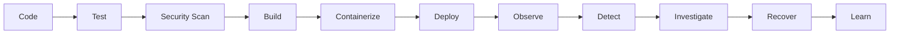
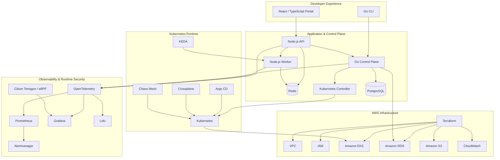
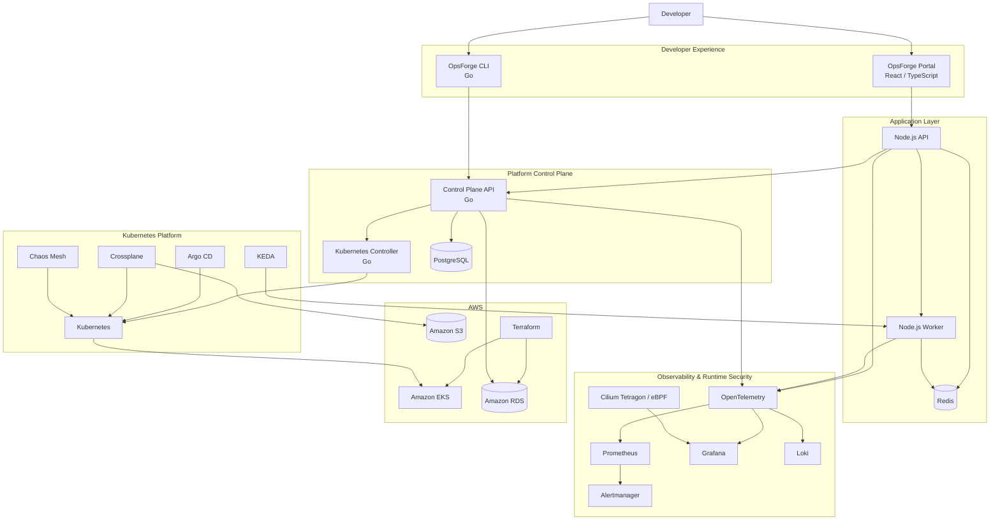

# OpsForge 2.0

### Internal Developer Platform · Platform Engineering · SRE · Cloud Native · DevSecOps

> **Build it. Deploy it. Observe it. Break it. Recover it.**

OpsForge 2.0 is a **production-oriented Internal Developer Platform (IDP) and SRE engineering laboratory** designed to demonstrate how modern cloud-native engineering capabilities operate as one cohesive system.

Rather than presenting Kubernetes, Terraform, GitOps, observability, security, autoscaling, and reliability engineering as isolated technologies, OpsForge connects them into a complete engineering lifecycle:



The objective is simple:

> **Demonstrate operational thinking, not just familiarity with individual DevOps tools.**

---

## What OpsForge Demonstrates

OpsForge brings together the major disciplines involved in building and operating a modern platform:

| Domain                           | Technologies                                      |
| -------------------------------- | ------------------------------------------------- |
| Application Platform             | Node.js API · Node.js Worker · Redis              |
| Internal Platform                | Go Control Plane · Go CLI · Kubernetes Controller |
| Developer Experience             | React · TypeScript                                |
| Containers                       | Docker                                            |
| Orchestration                    | Kubernetes                                        |
| Packaging & Configuration        | Helm · Kustomize                                  |
| Infrastructure as Code           | Terraform                                         |
| Kubernetes-Native Infrastructure | Crossplane                                        |
| GitOps                           | Argo CD                                           |
| Event-Driven Autoscaling         | KEDA                                              |
| Observability                    | OpenTelemetry · Prometheus · Grafana · Loki       |
| Alerting                         | Alertmanager                                      |
| Runtime Visibility               | Cilium Tetragon · eBPF                            |
| Security                         | Trivy · RBAC · NetworkPolicies · SecurityContexts |
| CI/CD                            | GitHub Actions · Jenkins                          |
| Reliability                      | SLI · SLO · Error Budgets · Burn Rate             |
| Failure Engineering              | Chaos Mesh                                        |
| Automation                       | Go · Python · Bash · PowerShell                   |

---

# Architecture

OpsForge is organized into five logical layers:



### End-to-End Architecture



---

# Platform Engineering

## Developer Experience

OpsForge provides two primary interfaces for interacting with the platform:

```text
Developer
   │
   ├── Web Portal
   │
   └── CLI
```

The **React / TypeScript developer portal** provides a web-based platform interface, while the **Go CLI** provides a command-line workflow.

This creates the foundation for platform-oriented capabilities such as self-service operations and standardized developer workflows.

---

## Control Plane

The platform separates platform operations from application business logic through a dedicated **Go control plane**.

```text
Portal / CLI
     │
     ▼
Go Control Plane
     │
     ├── PostgreSQL
     │
     └── Kubernetes Controller
              │
              ▼
          Kubernetes
```

The Kubernetes controller follows the reconciliation model:

```text
Desired State
     ↓
Custom Resource
     ↓
Go Controller
     ↓
Reconciliation
     ↓
Actual State
```

This provides hands-on implementation around:

* Kubernetes APIs
* Custom Resource Definitions
* Controllers
* Reconciliation
* REST APIs
* Concurrency
* Structured logging
* CLI development
* Testing

---

# Infrastructure & Delivery

## Terraform

Terraform manages the AWS infrastructure foundation.

```text
AWS
├── VPC
├── Networking
├── IAM
├── EKS
├── RDS
└── Supporting Resources
```

Typical workflow:

```bash
terraform init
terraform fmt
terraform validate
terraform plan
terraform apply
```

---

## Crossplane

OpsForge also demonstrates a Kubernetes-native infrastructure model through Crossplane:

```text
Kubernetes
     │
     ▼
Crossplane
     │
     ▼
Cloud Resources
```

This provides two complementary infrastructure-management approaches:

| Approach   | Responsibility                                   |
| ---------- | ------------------------------------------------ |
| Terraform  | Cloud foundation and infrastructure provisioning |
| Crossplane | Kubernetes-native infrastructure management      |

---

## GitOps

Argo CD provides declarative Kubernetes delivery:

```text
Developer
    ↓
Git Commit
    ↓
Git Repository
    ↓
Argo CD
    ↓
Kubernetes
```

The workflow supports:

* Declarative deployment
* Synchronization
* Drift detection
* Deployment health
* Rollback-oriented operations

---

# Observability

Observability is treated as a **platform capability**, not an afterthought.

```text
                    ┌── Prometheus
                    │
Application ──► OpenTelemetry ──┼── Grafana
                    │
                    └── Loki
```

## Metrics

Prometheus is used for operational signals including:

* Request rate
* Latency
* Error rate
* Resource utilization
* Queue depth
* Worker processing rate

## Logs

Loki provides centralized log aggregation with structured service logging where practical.

## Traces

OpenTelemetry provides distributed telemetry across application and platform components.

Example request path:

```text
API
 ↓
Control Plane
 ↓
Redis / PostgreSQL
 ↓
Worker
```

## Alerting

Alertmanager provides alert routing and grouping for conditions such as:

* Availability degradation
* Elevated error rates
* Latency
* Saturation
* Pod failures
* Queue backlog
* Infrastructure health

---

# Runtime Security

Security is integrated across both the delivery pipeline and runtime.

## Build & IaC Security

Trivy provides scanning for:

* Container image vulnerabilities
* Dependency vulnerabilities
* Infrastructure configuration

## Kubernetes Security

The platform incorporates:

* RBAC
* NetworkPolicies
* SecurityContexts
* Resource limits
* Least-privilege access

## Runtime Visibility

Cilium Tetragon provides lower-level runtime visibility into:

* Processes
* System activity
* Network behavior
* Container activity

This complements application-level metrics, logs, and traces with runtime-level signals.

---

# Event-Driven Autoscaling

OpsForge uses Redis-backed background workloads as the scaling signal for KEDA.

```text
Application
     ↓
Redis Queue
     ↓
Queue Depth
     ↓
KEDA
     ↓
Worker Replicas
```

Instead of relying exclusively on CPU or memory utilization, worker capacity can respond to **actual application workload**.

This models a more realistic event-driven scaling pattern for asynchronous workloads.

---

# SRE & Reliability Engineering

OpsForge applies core Site Reliability Engineering concepts directly to the platform.

## Four Golden Signals

| Signal     | Question                                        |
| ---------- | ----------------------------------------------- |
| Latency    | How long does the system take to respond?       |
| Traffic    | How much demand is the system receiving?        |
| Errors     | How often does the system fail?                 |
| Saturation | How close is the system to its resource limits? |

## SLO Model

```text
SLI
 ↓
SLO
 ↓
Error Budget
 ↓
Burn Rate
 ↓
Alert
 ↓
Incident Response
```

The goal is to connect reliability targets with actual operational decisions rather than treating SLOs as documentation only.

---

# Failure Engineering

A reliability platform should demonstrate more than the happy path.

OpsForge models controlled failure scenarios including:

### Application Failure

```text
Application Failure
       ↓
Kubernetes Detection
       ↓
Container Restart
       ↓
Health Recovery
```

### Queue Overload

```text
Traffic Increase
       ↓
Queue Growth
       ↓
KEDA Scaling
       ↓
Queue Drain
```

### Bad Deployment

```text
Deployment
    ↓
Error Rate Increase
    ↓
Alert
    ↓
Investigation
    ↓
Rollback
    ↓
Recovery
```

### Pod Disruption

```text
Pod Failure
    ↓
Kubernetes Rescheduling
    ↓
Replacement Pod
    ↓
Service Recovery
```

---

# Chaos Engineering

Chaos Mesh is used for controlled Kubernetes failure experiments.

Example:

```bash
kubectl apply \
  -f kubernetes/observability/chaos/pod-kill-experiment.yaml
```

The objective is not simply to create failure.

The engineering question is:

> **Can the platform detect the failure, maintain acceptable availability, recover, and provide enough telemetry for an engineer to diagnose the incident?**

---

# Validation & Evidence

The repository contains execution evidence documenting the engineering workflow.

> **Important:** These screenshots are lab validation evidence. They are not a claim that OpsForge operates as an always-on production service.

## Docker Compose

The local platform was brought up using Docker Compose and inspected with:

```bash
docker compose ps
```

The captured environment includes the local API, worker, control-plane API, UI, PostgreSQL, Redis, Prometheus, Grafana, Loki, Alertmanager, OpenTelemetry Collector, Jaeger, and supporting services.


---

## SRE Log Collection

The PowerShell diagnostic utility successfully collected logs from both application services:

```text
Collected: 2
Failed:    0
Archive:   created successfully
```


---

## Kubernetes Validation

The Kubernetes environment was inspected with:

```bash
kubectl get all -n dev
```

The validation demonstrates the creation of expected Kubernetes resources including:

* Deployments
* ReplicaSets
* Pods
* Services
* Redis
* HPA

The validation also exposed an `ImagePullBackOff / ErrImagePull` condition for the API and worker images.

This is intentionally documented as a **validation finding**, rather than being presented as a successful application deployment.


---

## Chaos Mesh Validation

A PodChaos experiment was successfully submitted:

```bash
kubectl apply \
  -f kubernetes/observability/chaos/pod-kill-experiment.yaml
```


---

## Environment Lifecycle

The local k3d cluster was subsequently removed:

```bash
k3d cluster delete opsforge-cluster
```

The intended lab lifecycle is:

```text
Provision
   ↓
Test
   ↓
Inspect
   ↓
Experiment
   ↓
Tear Down
```


---

## Terraform / AWS

Terraform was executed from:

```text
infrastructure/terraform/
```

The captured plan demonstrates AWS data-source resolution and planned infrastructure including:

* EKS
* Managed node-group components
* CloudWatch logging
* IAM
* OIDC / IRSA
* Security groups
* VPC networking
* Internet Gateway
* NAT infrastructure
* Kubernetes authentication configuration


<details>
<summary><strong>View Terraform plan capture set</strong></summary>


</details>

> **Security note:** The captured lab configuration includes broad network settings. These screenshots demonstrate infrastructure provisioning workflow and should not be treated as production security recommendations. Production EKS API access and security-group rules should be restricted to the minimum required scope.

---

# Getting Started

## Prerequisites

Install:

* Docker
* Docker Compose
* Git
* Node.js
* Go
* Python
* PowerShell

---

## Run Locally

Clone the repository:

```bash
git clone https://github.com/kunal-1207/OpsForge.git
cd OpsForge
```

Start the local platform:

```bash
docker compose up --build -d
docker compose ps
```

### Local Endpoints

| Service         | Endpoint                 |
| --------------- | ------------------------ |
| OpsForge Portal | `http://localhost:5173`  |
| Node.js API     | `http://localhost:3000`  |
| Grafana         | `http://localhost:3001`  |
| Jaeger          | `http://localhost:16686` |

> Ports may vary depending on the current Compose configuration.

---

# Kubernetes Deployment

OpsForge can be deployed to a local Kubernetes environment such as:

* k3d / k3s
* kind
* minikube
* Docker Desktop Kubernetes

Apply the development overlay:

```bash
kubectl apply -k kubernetes/overlays/dev
```

Inspect the environment:

```bash
kubectl get pods -A
kubectl get svc -A
kubectl get deployments -A
```

---

# SRE Automation

## PowerShell — Diagnostic Collection

```powershell
cd automation/powershell

.\Collect-Logs.ps1 `
  -Mode Docker `
  -Services api-service,worker-service `
  -OutputDirectory .\artifacts\logs
```

The collector produces a structured archive containing:

* Service logs
* Collection metadata
* Environment information
* Collection errors

---

## Python — Cluster Health

```bash
cd automation/python

pip install -r requirements.txt

python cluster-health.py \
  --prometheus-url http://localhost:9090
```

The health-check layer can inspect:

* Availability
* Error rates
* Latency
* Resource health
* Alert state

---

# Repository Structure

```text
OpsForge/
│
├── app/
│   ├── api-service/
│   └── worker-service/
│
├── services/
│   ├── opsforge-api/
│   └── opsforge-controller/
│
├── cli/
│   └── opsforge/
│
├── portal/
│   └── opsforge-ui/
│
├── database/
│   └── migrations/
│
├── infrastructure/
│   └── terraform/
│
├── kubernetes/
│   ├── base/
│   ├── overlays/
│   ├── crds/
│   ├── rbac/
│   ├── security/
│   ├── argocd/
│   ├── crossplane/
│   └── observability/
│
├── cicd/
│   └── jenkins/
│
├── .github/
│   └── workflows/
│
├── automation/
│   ├── python/
│   └── powershell/
│
├── chaos/
│
├── docs/
│   ├── architecture/
│   ├── getting-started/
│   ├── operations/
│   ├── runbooks/
│   └── adr/
│
├── docker-compose.yml
├── Makefile
└── README.md
```

---

# Engineering Capabilities Demonstrated

### Platform Engineering

`IDP` · `Control Planes` · `Kubernetes Controllers` · `CRDs` · `Developer Portals` · `Self-Service Workflows`

### Cloud & Infrastructure

`AWS` · `EKS` · `Terraform` · `Crossplane` · `IAM` · `VPC` · `RDS`

### Kubernetes & Containers

`Kubernetes` · `Docker` · `Helm` · `Kustomize` · `KEDA`

### GitOps & CI/CD

`Argo CD` · `GitHub Actions` · `Jenkins` · `GitOps`

### Observability

`OpenTelemetry` · `Prometheus` · `Grafana` · `Loki` · `Alertmanager` · `eBPF`

### Security

`Trivy` · `RBAC` · `NetworkPolicies` · `SecurityContexts` · `IaC Security`

### Reliability Engineering

`SLI` · `SLO` · `Error Budgets` · `Burn Rate` · `Incident Response` · `Runbooks` · `Chaos Engineering`

### Programming & Automation

`Go` · `Python` · `TypeScript` · `Node.js` · `Bash` · `PowerShell` · `Groovy`

---

# Security & Secrets

Never commit:

* AWS credentials
* Passwords
* API keys
* Private keys
* Access tokens
* Production secrets

Use environment variables, CI/CD secret stores, Kubernetes secret-management mechanisms, or appropriate cloud-native secret systems.

All credentials shown in examples must be **non-production placeholders**.

---

# Project Status

OpsForge 2.0 is an **active, production-oriented engineering sandbox and portfolio project**.

The repository demonstrates the architecture and workflows associated with modern:

* DevOps
* SRE
* Platform Engineering
* Cloud Infrastructure
* DevSecOps

The included evidence documents local execution and infrastructure validation.

Some capabilities require:

* AWS infrastructure
* A Kubernetes cluster
* Cloud credentials
* External controllers/operators
* Environment-specific configuration

Therefore, OpsForge should be evaluated as an **engineering laboratory and demonstrable portfolio platform**, not as a claim of an always-on production workload.

---

# Roadmap

* [ ] Multi-region deployment
* [ ] Service mesh integration
* [ ] Advanced policy enforcement
* [ ] External Secrets
* [ ] Progressive delivery
* [ ] Canary deployments
* [ ] Advanced chaos experiments
* [ ] Cost observability
* [ ] Multi-cluster management
* [ ] Expanded developer self-service
* [ ] Additional security automation

---

# Contributing

Contributions are welcome.

Create a feature branch:

```bash
git checkout -b feature/my-change
```

Before opening a pull request:

* Add or update tests where appropriate
* Validate affected infrastructure
* Document operational impact
* Document security considerations
* Explain what changed and why

---

# License

This project is licensed under the **MIT License**.

---

# Author

**Kunal Waghmare**

Cloud DevOps Engineer · Platform Engineering · Site Reliability Engineering

GitHub: `kunal-1207`

---

> ## OpsForge 2.0
>
> **Build it. Deploy it. Observe it. Break it. Recover it.**
