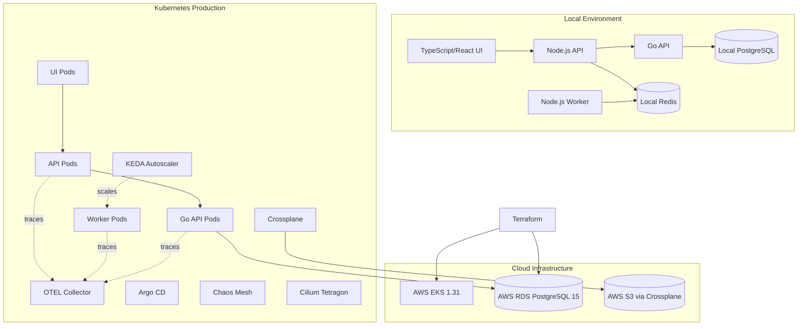

# OpsForge 2.0 (Internal Developer Platform & SRE Framework)

Welcome to **OpsForge 2.0**, a robust, production-oriented Internal Developer Platform (IDP) and SRE sandbox. This repository serves as a master blueprint showcasing modern cloud-native engineering, bridging the gap between local application development and production-grade Kubernetes orchestration.

## 🏛️ Architecture Overview

The platform incorporates multiple microservices and automation layers:



## 🚀 Quick Start Guide

OpsForge provides two distinct environments: a fast local setup via Docker Compose, and a production-like cluster via Kubernetes.

### 1. Local Development (Docker Compose)
Run the entire stack locally with integrated observability (Jaeger, Prometheus, Grafana).
```bash
docker compose up --build -d
```
- **UI Portal**: http://localhost:5173
- **API Service**: http://localhost:3000
- **Grafana**: http://localhost:3001
- **Jaeger**: http://localhost:16686

To tear down the environment:
```bash
docker compose down -v
```

### 2. Kubernetes Deployment (Local)
To deploy into a local cluster (e.g., k3d or minikube):
```bash
# Create local k3d cluster
k3d cluster create opsforge-cluster

# Deploy resources
kubectl apply -k kubernetes/overlays/dev

# Verify deployment
kubectl get all -n dev
```

---

## 🛠️ Platform Capabilities

### Infrastructure as Code (Terraform)
Provision the foundation on AWS (VPC, EKS, RDS) using Free Tier eligible instances (`t3.micro`).
- **Location:** `infrastructure/terraform/`
- **Commands:** 
  ```bash
  cd infrastructure/terraform
  terraform init
  terraform plan
  terraform apply -auto-approve
  ```
- **Connect to AWS Cluster:**
  ```bash
  aws eks update-kubeconfig --region ap-south-1 --name opsforge-cluster
  ```

### Cloud Integration (Crossplane)
Provision AWS resources natively from Kubernetes.
- **Location:** `kubernetes/crossplane/`
- **Commands:**
  ```bash
  kubectl apply -f kubernetes/crossplane/aws-provider.yaml
  kubectl apply -f kubernetes/crossplane/s3-bucket.yaml
  ```

### GitOps (Argo CD)
Automatically sync cluster state with the Git repository.
- **Location:** `kubernetes/argocd/`
- **Commands:** 
  ```bash
  kubectl apply -f kubernetes/argocd/opsforge-app.yaml
  ```

### CI/CD Pipelines
- **GitHub Actions**: Configured in `.github/workflows/` for continuous integration and security scanning.
- **Jenkins**: A declarative pipeline available in `cicd/jenkins/Jenkinsfile` for orchestration.

### Observability & eBPF
- **OpenTelemetry**: Integrated into Node.js and Go services for distributed tracing.
- **eBPF (Tetragon)**: Kernel-level process and network observability.
  - **Location:** `kubernetes/observability/ebpf/`
  - **Viewing logs:** `kubectl logs -n kube-system -l app.kubernetes.io/name=tetragon -c export-stdout -f`

### Autoscaling (KEDA)
Event-driven autoscaling for the background workers based on Redis queue length.
- **Location:** `kubernetes/base/keda-scaledobject.yaml`

### Security Hardening
Enforce least-privilege using Kubernetes NetworkPolicies and RBAC.
- **Location:** `kubernetes/security/`
- **Commands:** `kubectl apply -f kubernetes/security/`

### Chaos Engineering
Validate resilience and self-healing mechanisms using Chaos Mesh.
- **Location:** `kubernetes/observability/chaos/`
- **Experiment:** `kubectl apply -f kubernetes/observability/chaos/pod-kill-experiment.yaml`

---

## 🤖 SRE Automation Tools

We provide cross-platform automation tools for common operational tasks:

### Log Collection (PowerShell)
Gather logs from Docker Compose or Kubernetes, zipped with diagnostic metadata.
```powershell
cd automation/powershell
.\Collect-Logs.ps1 -Mode Docker -Services api-service,worker-service -OutputDirectory .\artifacts\logs
```

### Cluster Health (Python)
Verify service health directly against the Prometheus API.
```bash
cd automation/python
pip install -r requirements.txt
python cluster-health.py --prometheus-url http://localhost:9090
```

## 📝 License
This project is licensed under the MIT License.
