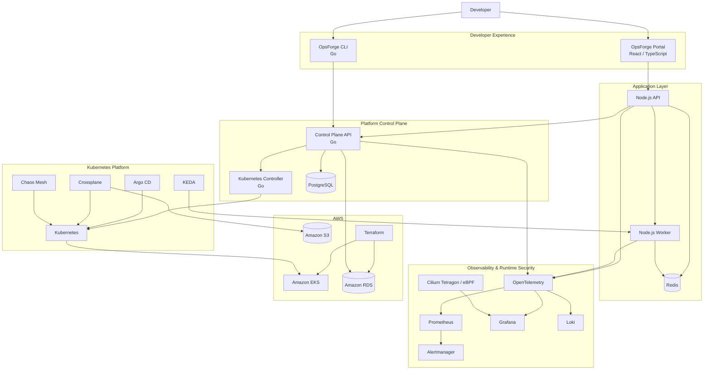

OpsForge 2.0
Internal Developer Platform · SRE · Cloud Native · DevSecOps
> **Build it. Deploy it. Observe it. Break it. Recover it.**
OpsForge 2.0 is a production-oriented engineering sandbox that brings application delivery, Kubernetes, infrastructure as code, GitOps, observability, security, autoscaling, and reliability engineering into one cohesive platform.
It is designed to answer a practical question:
What does a modern DevOps / SRE / Platform Engineering workflow look like when the individual tools have to operate as one system?
---
Platform at a Glance
Capability	Implementation
Application Platform	Node.js API · Node.js Worker · Redis
Internal Platform	Go Control Plane · Go CLI · Kubernetes Controller
Developer Experience	TypeScript / React Developer Portal
Containers	Docker
Orchestration	Kubernetes
Packaging & Config	Helm · Kustomize
Infrastructure as Code	Terraform
Kubernetes-Native Infrastructure	Crossplane
GitOps	Argo CD
Autoscaling	KEDA
Observability	OpenTelemetry · Prometheus · Grafana · Loki
Alerting	Alertmanager
Runtime Visibility	Cilium Tetragon / eBPF
Security	Trivy · RBAC · NetworkPolicies · SecurityContexts
CI/CD	GitHub Actions · Jenkins
Reliability	SLI · SLO · Error Budgets · Burn Rate
Failure Engineering	Chaos Mesh
Automation	Go · Python · PowerShell · Bash
---
Why OpsForge Exists
OpsForge is intentionally more than a collection of DevOps tools.
The platform models the engineering lifecycle from code to operations:
```text
┌──────────────┐
│     Code     │
└──────┬───────┘
       ↓
┌──────────────┐
│     Test     │
└──────┬───────┘
       ↓
┌──────────────┐
│ Security Scan│
└──────┬───────┘
       ↓
┌──────────────┐
│    Build     │
└──────┬───────┘
       ↓
┌──────────────┐
│  Containerize│
└──────┬───────┘
       ↓
┌──────────────┐
│    Deploy    │
└──────┬───────┘
       ↓
┌──────────────┐
│   Observe    │
└──────┬───────┘
       ↓
┌──────────────┐
│    Detect    │
└──────┬───────┘
       ↓
┌──────────────┐
│  Investigate │
└──────┬───────┘
       ↓
┌──────────────┐
│    Recover   │
└──────┬───────┘
       ↓
     Learn
```
The goal is to demonstrate operational thinking, not simply familiarity with individual technologies.
---
Architecture
OpsForge is organized around five logical layers:
Developer Experience
Application & Platform Control Plane
Kubernetes Runtime
Observability & Runtime Security
AWS Infrastructure

---
Engineering Model
Developer Experience
The developer-facing layer provides two paths into the platform:
```text
Developer
   │
   ├── Web Portal
   │
   └── CLI
```
The portal is implemented with React / TypeScript, while the CLI is implemented in Go.
Platform Control Plane
The Go control plane separates platform operations from application business logic.
```text
Portal / CLI
     │
     ▼
Go Control Plane
     │
     ├── PostgreSQL
     │
     └── Kubernetes Controller
                │
                ▼
           Kubernetes
```
The Kubernetes controller follows the reconciliation model:
```text
Desired State
      ↓
Custom Resource
      ↓
Go Controller
      ↓
Reconciliation
      ↓
Actual State
```
This provides hands-on exposure to Kubernetes APIs, CRDs, controllers, reconciliation, REST APIs, concurrency, structured logging, CLI development, and testing.
---
Delivery & Infrastructure
Terraform
Terraform manages the foundational AWS infrastructure.
The infrastructure layer covers the AWS foundation required by the platform, including:
```text
AWS
├── VPC
├── Networking
├── IAM
├── EKS
├── RDS
└── Supporting resources
```
Typical workflow:
```bash
terraform init
terraform fmt
terraform validate
terraform plan
terraform apply
```
Crossplane
Crossplane demonstrates a complementary Kubernetes-native infrastructure model:
```text
Kubernetes
     │
     ▼
 Crossplane
     │
     ▼
Cloud Resources
```
This gives the project two distinct infrastructure-management perspectives:
Terraform → infrastructure provisioning and cloud foundation
Crossplane → Kubernetes-native infrastructure management
GitOps
Argo CD provides declarative Kubernetes delivery:
```text
Developer
    ↓
Git Commit
    ↓
Git Repository
    ↓
Argo CD
    ↓
Kubernetes
```
The model supports synchronization, drift detection, deployment health, and rollback-oriented workflows.
---
Observability
Observability is treated as a platform capability rather than an afterthought.
```text
                    ┌── Prometheus
                    │
Application ──► OpenTelemetry ──┼── Grafana
                    │
                    └── Loki
```
Metrics
Prometheus is used for operational and application metrics such as:
request rate
latency
error rate
resource utilization
queue depth
worker processing rate
Logs
Loki provides centralized log aggregation, with structured service logging used where practical.
Traces
OpenTelemetry provides distributed telemetry across application and platform components, enabling request-path analysis across:
```text
API
 ↓
Control Plane
 ↓
Redis / PostgreSQL
 ↓
Worker
```
Alerting
Alertmanager handles alert routing and grouping for conditions such as:
availability degradation
elevated error rates
latency
saturation
pod failures
queue backlog
infrastructure health
---
Runtime Security
OpsForge incorporates security into both the delivery and runtime layers.
Build / IaC Security
Trivy is used for:
container image vulnerability scanning
dependency vulnerability scanning
infrastructure configuration scanning
Kubernetes Security
The platform incorporates:
RBAC
NetworkPolicies
SecurityContexts
resource limits
least-privilege access
eBPF Runtime Visibility
Cilium Tetragon provides lower-level runtime visibility into:
processes
system activity
network behavior
container activity
The intent is to complement application metrics, logs, and traces with runtime-level signals.
---
Event-Driven Scaling
Redis-backed background jobs provide the workload signal for KEDA.
```text
Application
     ↓
Redis Queue
     ↓
Queue Depth
     ↓
KEDA
     ↓
Worker Replicas
```
As queue depth changes, KEDA can adjust worker capacity based on application workload rather than relying exclusively on CPU or memory utilization.
---
Reliability Engineering
OpsForge applies core SRE concepts to the platform.
Four Golden Signals
Signal	Question
Latency	How long does the system take to respond?
Traffic	How much demand is the system receiving?
Errors	How often does the system fail?
Saturation	How close is the system to its resource limits?
SLO Model
```text
SLI
 ↓
SLO
 ↓
Error Budget
 ↓
Burn Rate
 ↓
Alert
 ↓
Incident Response
```
The purpose is to connect reliability targets with operational decisions.
---
Failure Engineering
A reliability platform should not only demonstrate the happy path.
OpsForge includes controlled failure scenarios covering:
Application failure
```text
Application Failure
       ↓
Kubernetes Detection
       ↓
Container Restart
       ↓
Health Recovery
```
Queue overload
```text
Traffic Increase
       ↓
Queue Growth
       ↓
KEDA Scaling
       ↓
Queue Drain
```
Bad deployment
```text
Deployment
    ↓
Error Rate Increase
    ↓
Alert
    ↓
Investigation
    ↓
Rollback
    ↓
Recovery
```
Pod disruption
```text
Pod Failure
    ↓
Kubernetes Rescheduling
    ↓
Replacement Pod
    ↓
Service Recovery
```
---
Chaos Engineering
Chaos Mesh is used for controlled Kubernetes failure experiments.
Example:
```bash
kubectl apply \
  -f kubernetes/observability/chaos/pod-kill-experiment.yaml
```
The objective is not simply to cause failure.
The engineering question is:
> **Can the platform detect the failure, maintain acceptable availability, recover, and provide enough telemetry for an engineer to diagnose the incident?**
---
Validation Evidence
The repository contains execution screenshots documenting the engineering workflow.
> These screenshots are **lab validation evidence**, not a claim that OpsForge is operating as a production service.
Docker Compose
The local platform was brought up with Docker Compose and inspected with:
```bash
docker compose ps
```
The captured environment shows the local API, worker, control-plane API, UI, PostgreSQL, Redis, Prometheus, Grafana, Loki, Alertmanager, OpenTelemetry Collector, Jaeger, and supporting services running.

SRE Log Collection
The PowerShell diagnostic utility successfully collected logs from both application services:
```text
Collected: 2
Failed:    0
Archive:   created successfully
```

Kubernetes Validation
The Kubernetes environment was inspected with:
```bash
kubectl get all -n dev
```
The capture demonstrates creation of the expected Kubernetes resources, including Deployments, ReplicaSets, Pods, Services, Redis, and an HPA.
The same validation also exposed an ImagePullBackOff / ErrImagePull condition for the API and worker images. This is deliberately documented as a validation finding rather than being presented as a successful application deployment.

Chaos Mesh
A PodChaos experiment was successfully submitted:
```bash
kubectl apply \
  -f kubernetes/observability/chaos/pod-kill-experiment.yaml
```

Environment Lifecycle
The k3d cluster was subsequently removed with:
```bash
k3d cluster delete opsforge-cluster
```
This demonstrates the intended lab lifecycle: provision → test → inspect → experiment → tear down.

Terraform / AWS
Terraform was executed from:
```text
infrastructure/terraform/
```
The captured plan shows AWS data-source resolution and planned resources including EKS, managed node-group components, CloudWatch logging, IAM, OIDC/IRSA, security groups, VPC networking, Internet Gateway, NAT infrastructure, and Kubernetes authentication configuration.

<details>
<summary><strong>View Terraform plan capture set</strong></summary>


</details>
> **Security note:** the captured lab configuration includes broad network settings. These screenshots demonstrate infrastructure provisioning workflow and should not be treated as production security recommendations. Production EKS API access and security-group rules should be restricted to the minimum required scope.
---
Local Development
Prerequisites
Docker
Docker Compose
Git
Node.js
Go
Python
PowerShell
Start the platform
```bash
git clone https://github.com/kunal-1207/OpsForge.git
cd OpsForge

docker compose up --build -d
docker compose ps
```
Typical local endpoints:
Service	Endpoint
OpsForge Portal	`http://localhost:5173`
Node.js API	`http://localhost:3000`
Grafana	`http://localhost:3001`
Jaeger	`http://localhost:16686`
> Ports may vary with the current Compose configuration.
---
Kubernetes
OpsForge can be deployed to a local Kubernetes environment such as:
k3d / k3s
kind
minikube
Docker Desktop Kubernetes
Apply the development overlay:
```bash
kubectl apply -k kubernetes/overlays/dev
```
Inspect the environment:
```bash
kubectl get pods -A
kubectl get svc -A
kubectl get deployments -A
```
---
SRE Automation
PowerShell — Diagnostic Collection
```powershell
cd automation/powershell

.\Collect-Logs.ps1 `
  -Mode Docker `
  -Services api-service,worker-service `
  -OutputDirectory .\artifacts\logs
```
The collector produces a structured archive containing service logs, collection metadata, environment information, and collection errors.
Python — Cluster Health
```bash
cd automation/python

pip install -r requirements.txt

python cluster-health.py \
  --prometheus-url http://localhost:9090
```
The health-check layer can inspect availability, error rates, latency, resource health, and alert state.
---
Repository Structure
```text
OpsForge/
│
├── app/
│   ├── api-service/
│   └── worker-service/
│
├── services/
│   ├── opsforge-api/
│   └── opsforge-controller/
│
├── cli/
│   └── opsforge/
│
├── portal/
│   └── opsforge-ui/
│
├── database/
│   └── migrations/
│
├── infrastructure/
│   └── terraform/
│
├── kubernetes/
│   ├── base/
│   ├── overlays/
│   ├── crds/
│   ├── rbac/
│   ├── security/
│   ├── argocd/
│   ├── crossplane/
│   └── observability/
│
├── cicd/
│   └── jenkins/
│
├── .github/
│   └── workflows/
│
├── automation/
│   ├── python/
│   └── powershell/
│
├── chaos/
├── docs/
│   ├── architecture/
│   ├── getting-started/
│   ├── operations/
│   ├── runbooks/
│   └── adr/
│
├── docker-compose.yml
├── Makefile
└── README.md
```
---
Engineering Skills Demonstrated
Platform Engineering
`IDP` · `Control Planes` · `Kubernetes Controllers` · `CRDs` · `Developer Portals` · `Self-Service Workflows`
Cloud & Infrastructure
`AWS` · `EKS` · `Terraform` · `Crossplane` · `IAM` · `VPC` · `RDS`
Kubernetes & Containers
`Kubernetes` · `Docker` · `Helm` · `Kustomize` · `KEDA`
GitOps & CI/CD
`Argo CD` · `GitHub Actions` · `Jenkins` · `GitOps`
Observability
`OpenTelemetry` · `Prometheus` · `Grafana` · `Loki` · `Alertmanager` · `eBPF`
Security
`Trivy` · `RBAC` · `NetworkPolicies` · `SecurityContexts` · `IaC Security`
Reliability
`SLI` · `SLO` · `Error Budgets` · `Burn Rate` · `Incident Response` · `Runbooks` · `Chaos Engineering`
Programming & Automation
`Go` · `Python` · `TypeScript` · `Node.js` · `Bash` · `PowerShell` · `Groovy`
---
Security & Secrets
Never commit:
AWS credentials
passwords
API keys
private keys
access tokens
production secrets
Use environment variables, CI/CD secret stores, Kubernetes secret-management mechanisms, or appropriate cloud-native secret systems.
All credentials shown in examples must be non-production placeholders.
---
Project Status
OpsForge 2.0 is an active, production-oriented engineering sandbox and portfolio project.
The repository demonstrates the architecture and workflows of a modern DevOps / SRE / Platform Engineering environment.
The included evidence documents local execution and infrastructure validation. Some components require:
AWS infrastructure
a Kubernetes cluster
cloud credentials
external controllers/operators
environment-specific configuration
The repository should therefore be evaluated as an engineering laboratory and demonstrable portfolio platform, not as a claim of an always-on production workload.
---
Roadmap
Multi-region deployment
Service mesh integration
Advanced policy enforcement
External Secrets
Progressive delivery
Canary deployments
Advanced chaos experiments
Cost observability
Multi-cluster management
Expanded developer self-service
Additional security automation
---
Contributing
Contributions are welcome.
```bash
git checkout -b feature/my-change
```
Before opening a pull request:
Add or update tests where appropriate.
Validate affected infrastructure.
Document operational impact.
Document security considerations.
Explain what changed and why.
---
License
MIT License
---
Author
Kunal Waghmare
Cloud DevOps Engineer · Platform Engineering · Site Reliability Engineering
GitHub: `kunal-1207`
---
> **OpsForge 2.0**
>
> *Build it. Deploy it. Observe it. Break it. Recover it.*
